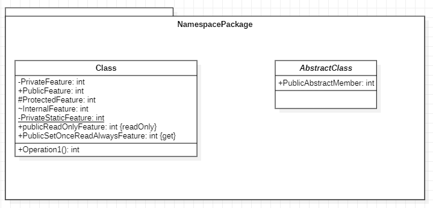

# Project-Randy
Randy is a great teacher to inspire you do more

## UML 
Here is a section to know all about Unified Modeling Language (UML).

Some useful links:
- [UML Class and Object Diagrams Overview](https://www.uml-diagrams.org/class-diagrams-overview.html)

-----
## Class Diagrams
Class diagram is UML structure diagram which shows structure of the designed system at the level of **classes** and **interfaces**, **shows their features**, **constraints** and **relationships - associations**, **generalizations**, **dependencies**, etc.

Some common types of class diagrams are:
- domain model diagram,
- diagram of implementation classes.

Object diagram could be considered as instance level class diagram which shows instance specifications of classes and interfaces (objects), slots with value specifications, and links (instances of association).

#### Domain Model Diagram


#### Diagram of Implementation Classes


#### Object Diagram


----
### Class
[Reference](https://www.uml-diagrams.org/class.html)

A class is a classifier which describes a set of objects that share the same
- features,
- constraints,
- semantics (meaning).

A class is shown as a solid-outline rectangle containing the class name, and optionally with compartments separated by horizontal lines containing features or other members of the classifier.

As class is the most widely used classifier, there is no need to add the "class" keyword in guillemets above the class name. Class name should be centered and in bold face, with the first letter of class name capitalized (if the character set supports upper case).

Features of a class are attributes and operations.

Characteristics represented by feature may be of the classifier’s instances considered individually (not static) or of the classifier itself (static).

------
Namespace or Package



```C#
namespace Namespace
{
    public abstract class AbstractClass
    {
        public abstract int PublicAbstractFeature { get; set; }
    }

    public class Class
    {
        private int PrivateFeature { get; set; }
        public int PublicFeature { get; set; }
        protected int ProtectedFeature { get; set; }
        internal int InternalFeature { get; set; }

        private static int PrivateStaticFeature { get; set; }

        public readonly int _publicReadOnlyFeature;
        public int PublicSetOnceReadAlwaysFeature { get; }

        public int Operation1()
        {
            return 0;
        }
    }
}
```